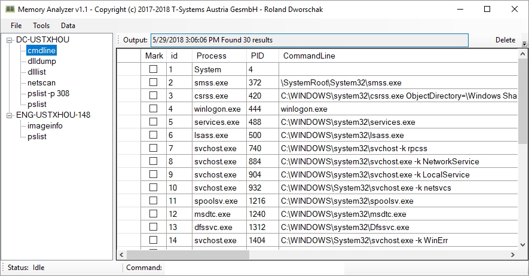

# Memory Analyzer

The Memory Analyzer is a GUI for Rekall written in C#, automating queries and marking results based on filters.

## Quick start

The Memory Analyzer is available as .exe for Windows or source-code for C# here. You also need Rekall itself from https://github.com/google/rekall installed.

Analysis is started by selecting the Rekall binary and your Memory Image:


and results are shown once finished analyzing:



## Configuration

All configuration files are JSON encoded and located within the Memory Analyzer folder.

### Default Commands

List of rekall commands executed upon starting. This file will be automatically created on first start.

default.json
```
["netscan","pslist","psxview","mimikatz"]
```

### Model

Defines the representation of the Rekall output along with filter and query options. Available options:

query <rekall command>: executes given Rekall command (along with the field value):
  
  
filter: allows to add/remove value to `known` list and automatically marks unknown values:
  

model.json
```
{
  "pslist":{
    "name":"pslist",
    "columns":[
      {"name":"_EPROCESS","options":null,"type":0,"field":["_EPROCESS","offset"]},
      {"name":"fullpath","options":["filter"],"type":1,"field":["_EPROCESS","Cybox","Image_Info","Command_Line"]},
      {"name":"pid","options":["query dlllist"],"field":["_EPROCESS","Cybox","PID"]},
      {"name":"ppid","options":["query dlllist"],"field":["ppid"]},
      {"name":"process_create_time","options":null,"type":1,"field":["process_create_time","string_value"]},
      {"name":"process_exit_time","options":null,"type":1,"field":["process_exit_time","string_value"]}
    ]
  },
  ...
}
```

### Known Lists

Simple list of known values (probably allowing regular expressions in future). These lists are automatically created or updated whenever a user adds or removes a value within the GUI.

known-&lt;field name&gt;.json (i.e. known-fullpath.json)
```
[
  "C:\\MemoryDump\\RamCapture64.exe",
  "C:\\Windows\\Explorer.EXE",
  ...
]
```